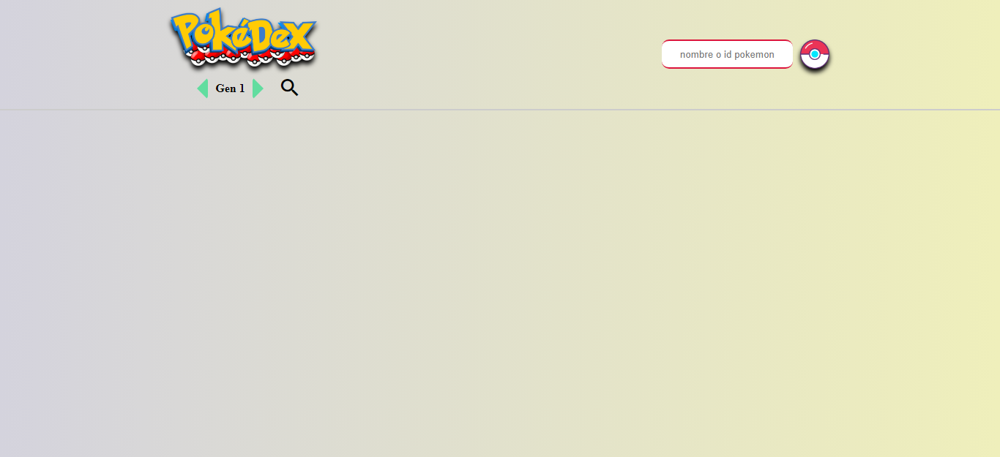

# POKEDEX WEB #

Aplicación web que obtiene los datos de una api, por medio del método fetch de manera asíncrona.

## MODO DE USO ##
con esta aplicación tienes dos maneras de consultar la pokedex:
- Por generaciones de pokemones.
- Buscando un pokemon en concreto.

#### 1. Por generaciones de pokemones ####
Seleccionas la generación de pokemones que te interese y le das a buscar, tras esto te apareceran cada uno de los pokemones de la generación en un tarjeta con su información básica.
Tienes disponible 8 generaciones de pokemones por el momento.

#### 2. Buscando un pokemon en concreto ####
En el campo de texto puedes indicar tanto el nombre del pokemon como su número y le das a la pokeball para realizar la búsqueda, tras lo cual te aparecerá en una ventana modal la información del pokemon solicitado.

